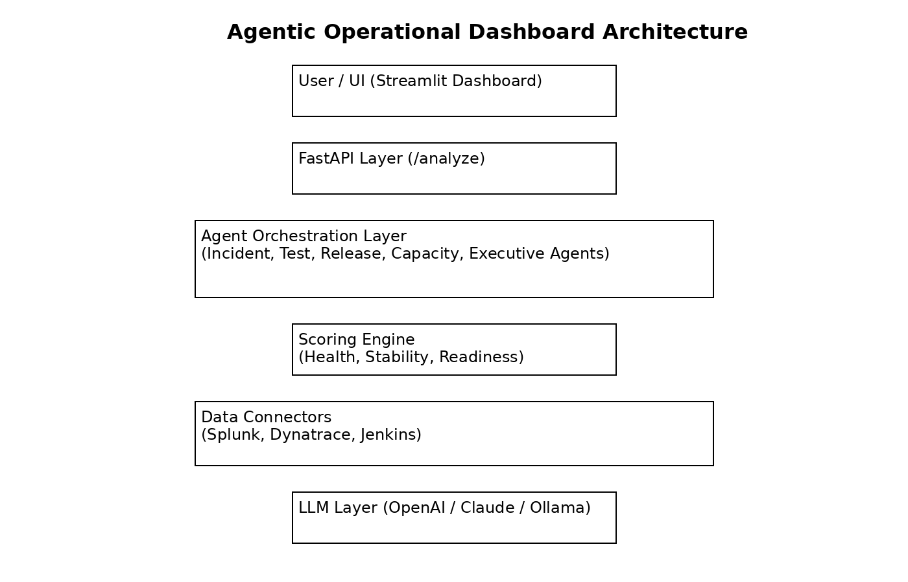

# Agentic Operational Dashboard

Portfolio-ready GenAI + Agentic AI operational intelligence dashboard for engineering, QA, SRE, and leadership teams.

This project demonstrates how to combine observability data, incident intelligence, test stability, release readiness, and GenAI-powered agents into one operational dashboard.

## What this project solves

Engineering leaders often have signals spread across:

- Splunk logs
- Dynatrace health metrics
- CI/CD pipelines
- test automation results
- incident reports
- release notes
- service ownership data

This dashboard turns those fragmented signals into:

- operational health score
- incident summary
- AI-generated root-cause hypothesis
- flaky test insights
- release readiness score
- executive summary
- recommended next actions

## Key Features

- FastAPI backend
- Streamlit dashboard UI
- Agentic workflow orchestration
- GenAI summarization layer
- OpenAI / Claude / Ollama / local fallback support
- SQLite local mode
- Postgres-ready structure
- Mock connectors for Splunk, Dynatrace, Jenkins, GitHub Actions
- Operational score engine
- Incident analyst agent
- Test stability agent
- Release readiness agent
- Executive summary agent
- Docker Compose
- GitHub Actions CI
- Agent skill files and `AGENTS.md`

## Architecture
 


```text
Observability / CI / Test Data
        |
        v
Connector Layer
        |
        v
Metric Normalizer
        |
        v
Agent Orchestrator
        |
        +-- Incident Analyst Agent
        +-- Test Stability Agent
        +-- Release Readiness Agent
        +-- Cost & Capacity Agent
        +-- Executive Summary Agent
        |
        v
Operational Intelligence API
        |
        v
Streamlit Dashboard
```

## Quick Start

```bash
python -m venv .venv
source .venv/bin/activate
pip install -e ".[dev]"
cp .env.example .env
python scripts/seed_demo_data.py
uvicorn operational_dashboard.api.main:app --reload
```

Open:

```text
http://127.0.0.1:8000/docs
```

Run dashboard:

```bash
streamlit run ui/streamlit_app.py
```

## Docker

```bash
cp .env.example .env
docker compose up --build
```

Services:

- API: http://localhost:8000/docs
- UI: http://localhost:8501

## Demo Prompt

Use this prompt from the UI:

> Analyze current production readiness, explain key risks, summarize test instability, and generate an executive update.

## LLM Providers

Default local mode:

```env
LLM_PROVIDER=rule_based
```

OpenAI:

```env
LLM_PROVIDER=openai
OPENAI_API_KEY=your_key
OPENAI_MODEL=gpt-4o-mini
```

Claude:

```env
LLM_PROVIDER=anthropic
ANTHROPIC_API_KEY=your_key
ANTHROPIC_MODEL=claude-3-5-sonnet-latest
```

Ollama:

```env
LLM_PROVIDER=ollama
OLLAMA_BASE_URL=http://localhost:11434
OLLAMA_MODEL=llama3.1
```

## Portfolio Talking Points

This project demonstrates:

- AI-driven operational intelligence
- GenAI for executive reporting
- agentic root-cause analysis
- SRE + QA + release engineering alignment
- AI-assisted incident triage
- reliability and test stability dashboards
- enterprise-ready architecture patterns
